<picture>
  <source media="(prefers-color-scheme: dark)" srcset="assets/banner-dark.svg" />
  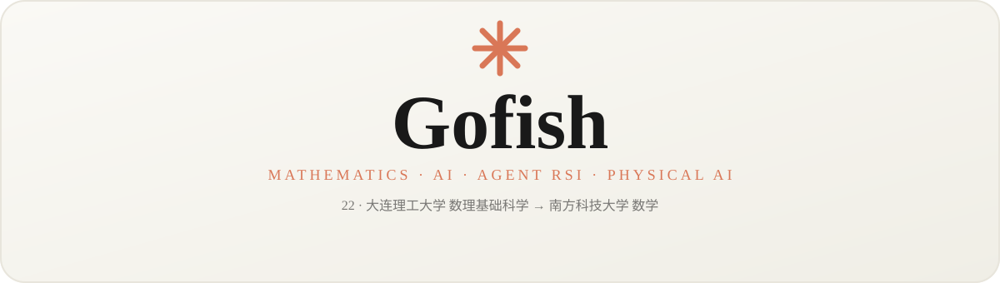
</picture>

<!-- 语言切换：点任意一枚徽章，跳到该语言的完整主页 -->

  
  

  
  
  
  

<b>🇬🇧 English</b>

 

<h2>About</h2>

<table>
  <tr>
    <td align="center" width="200">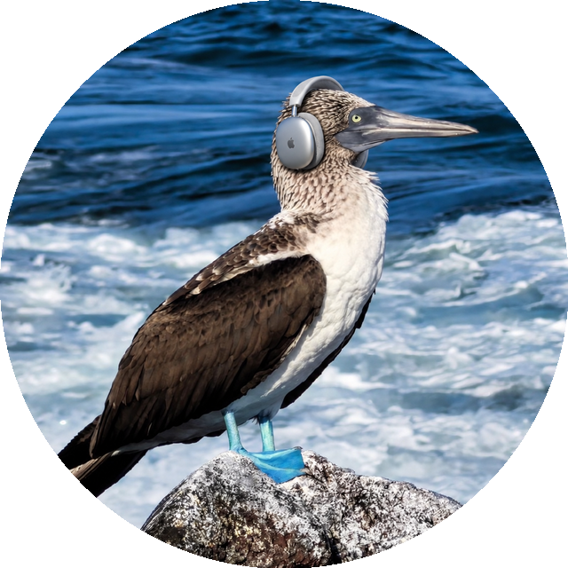</td>
    <td>Hi, I'm Gofish. I'm currently pursuing a master's in mathematics at Southern University of Science and Technology, after studying Mathematical Foundation Science at Dalian University of Technology. Mathematics is where I begin to understand problems, and AI keeps bringing me new ones.  What fascinates me most is how agents improve themselves through experience, and how intelligence can truly enter the physical world through perception and action. I hope to find my own research direction between solid mathematical thinking and concrete experiments.  Off screen, I love traveling, badminton, cooking, and movies. To me, studying a problem seriously and cooking a meal seriously are both worth the effort.</td>
  </tr>
</table>

- 🧑 **22 · Male · Notes of 2026**
- 🎓 **Dalian University of Technology** · Mathematical Foundation Science · Bachelor's (2022 — 2026)
- 🎓 **Southern University of Science and Technology** · Mathematics · Master's (2026 — 2029)
- 🧭 **Agent RSI · Physical AI**

<h2>Education</h2>

<table>
  <tr>
    <td width="40">🎓</td>
    <td><b>Southern University of Science and Technology</b></td>
    <td>Mathematics · Master's</td>
    <td align="right">2026 — 2029</td>
  </tr>
  <tr>
    <td width="40">🎓</td>
    <td><b>Dalian University of Technology</b></td>
    <td>Mathematical Foundation Science · Bachelor's</td>
    <td align="right">2022 — 2026</td>
  </tr>
</table>

<h2>What I'm curious about</h2>

From abstract reasoning toward intelligence that can learn, act, and keep improving.

<h3>01 · Agent RSI — Agents · Recursive self-improvement</h3>

I'm interested in how agents accumulate experience through action, feedback, and reflection, gradually improving their strategies and abilities. I also want to understand: how can we reliably measure such improvement?

Self-learning · Feedback &amp; reflection · Capability evaluation

<b>Act → Feedback → Reflect → Improve</b>

<h3>02 · Physical AI — Perception · Action · The real world</h3>

I'm curious about the questions that connect digital intelligence and the physical world: how to understand environments, build world models, and turn reasoning into reliable action?

Embodied intelligence · World models · Perception &amp; decision

<b>Perceive → Understand → Decide → Act</b>

<h2>Also living fully</h2>

Life has more than one coordinate system. I wander into mountains, sweat on the badminton court, and find small surprises in the kitchen and on screen.

<table>
  <tr>
    <td width="40" align="center">↗</td>
    <td><b>Badminton</b></td>
    <td>Swing, run, sweat — a breath of fresh air for the mind.</td>
  </tr>
  <tr>
    <td width="40" align="center">⌁</td>
    <td><b>Travel &amp; wandering</b></td>
    <td>Leaving familiar routes, collecting different scenery.</td>
  </tr>
  <tr>
    <td width="40" align="center">◡</td>
    <td><b>Cooking</b></td>
    <td>Taking three meals a day seriously, in the warmth of the kitchen.</td>
  </tr>
  <tr>
    <td width="40" align="center">▷</td>
    <td><b>Film &amp; stories</b></td>
    <td>Living another life through a screen.</td>
  </tr>
</table>

<h2>Moments</h2>

<table>
  <tr>
    <td width="50%">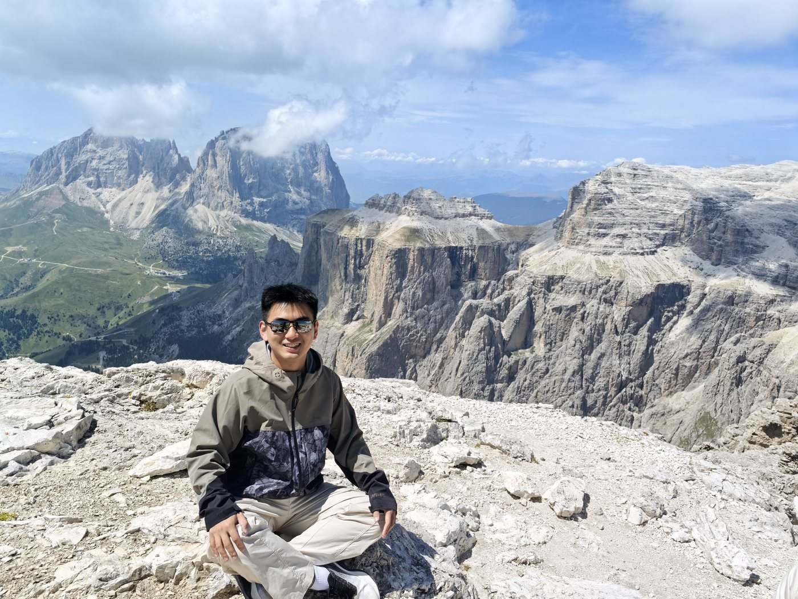</td>
    <td width="50%">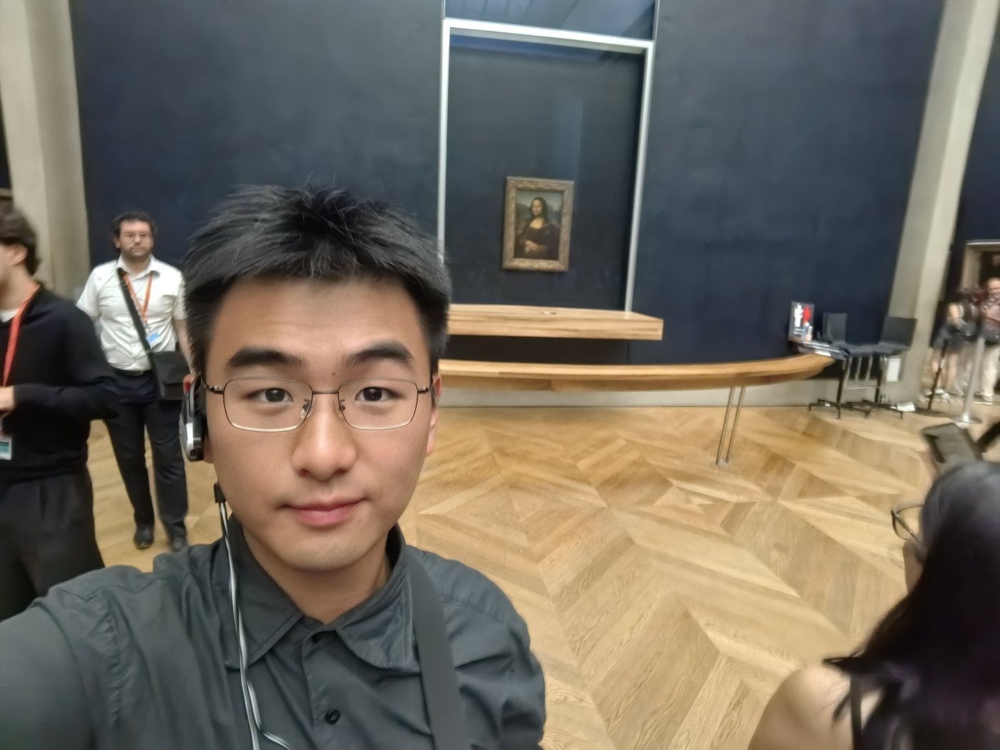</td>
  </tr>
  <tr>
    <td width="50%">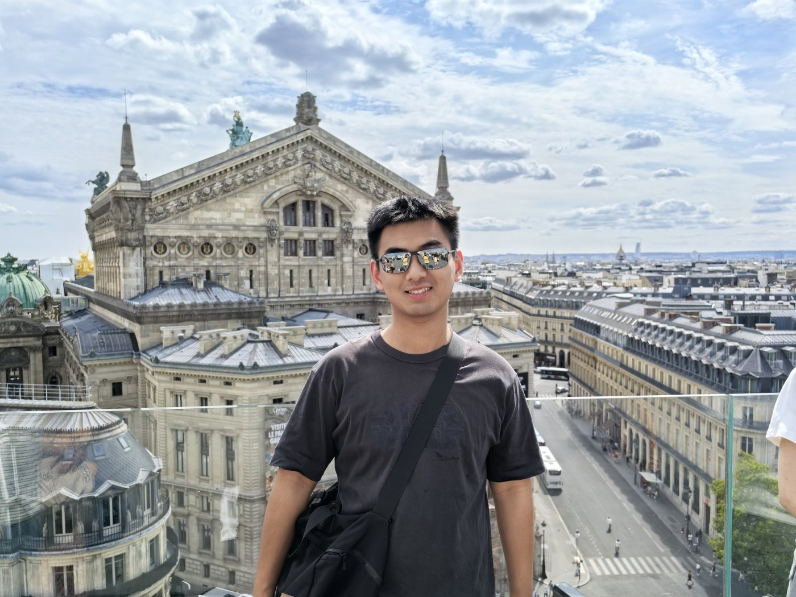</td>
    <td width="50%">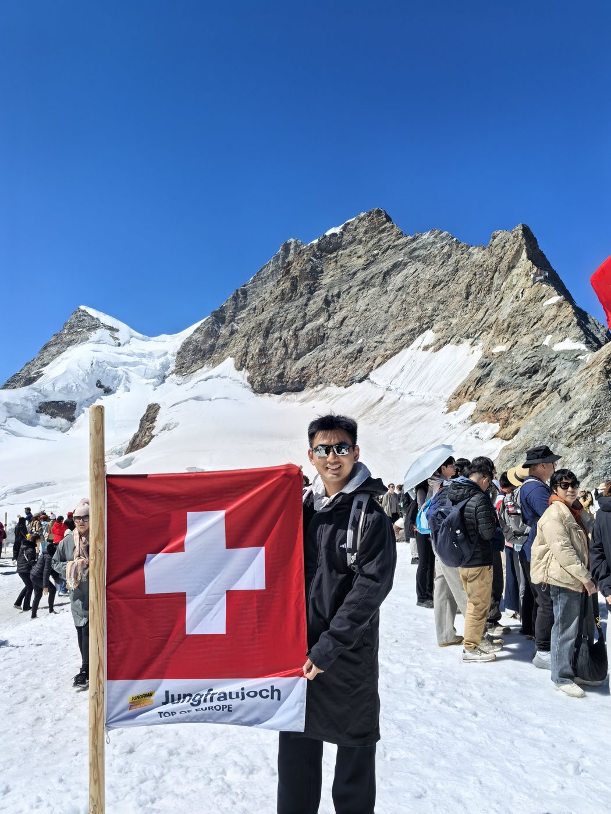</td>
  </tr>
  <tr>
    <td width="50%">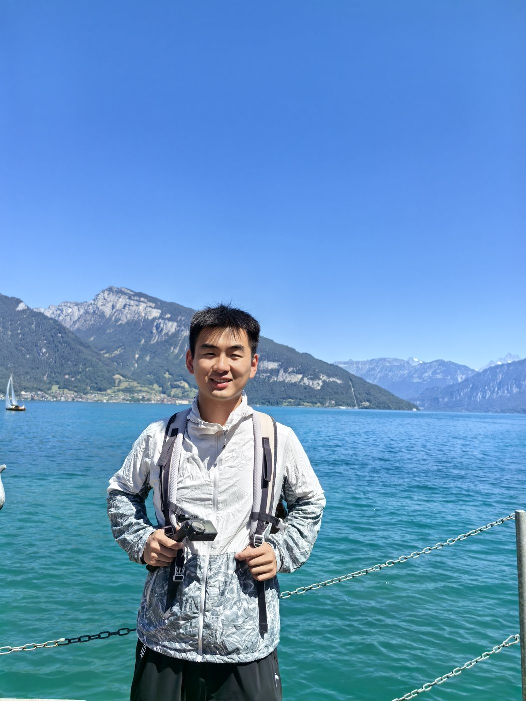</td>
    <td width="50%">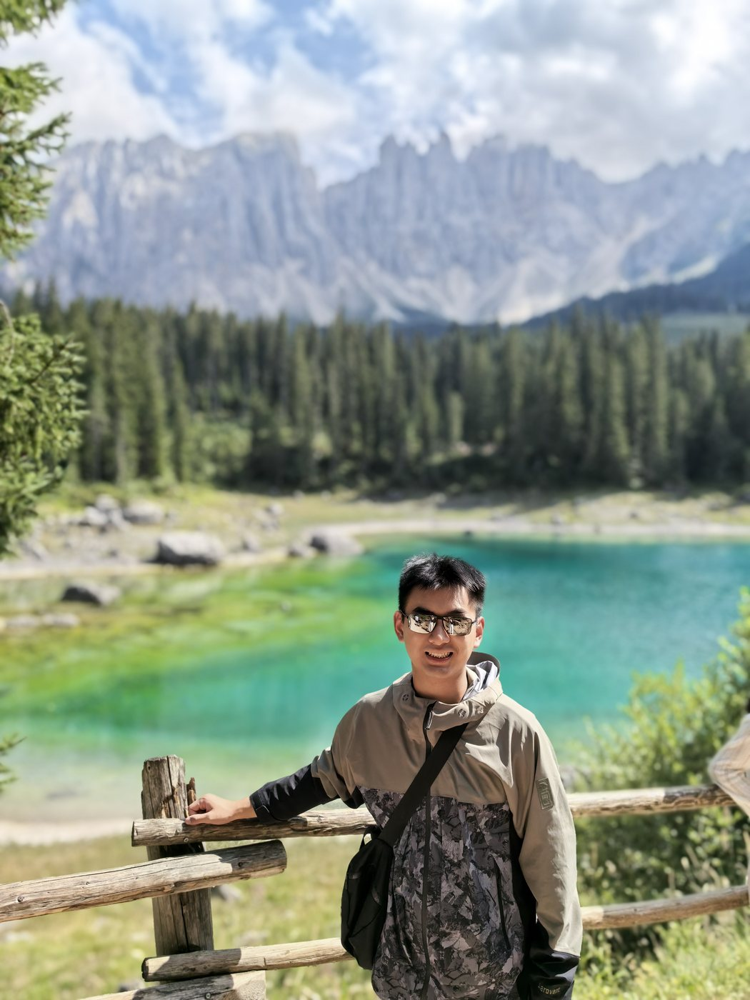</td>
  </tr>
  <tr>
    <td width="50%">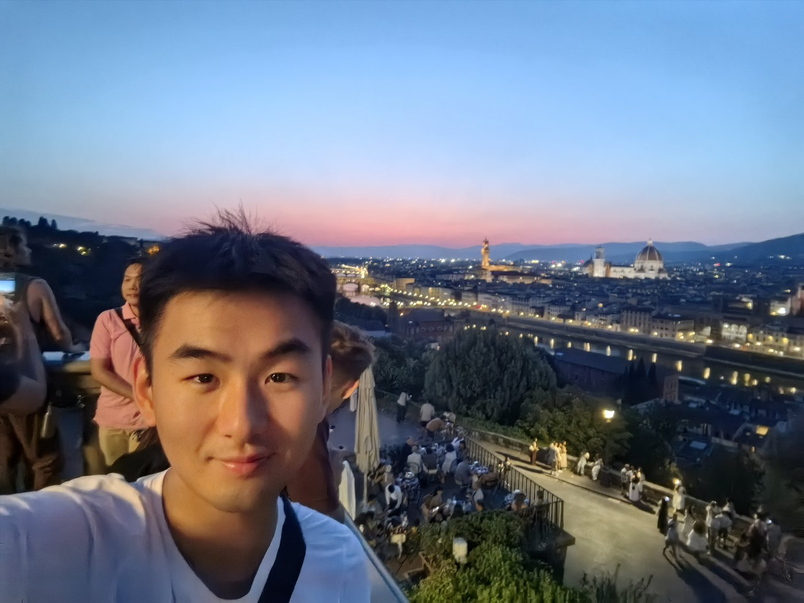</td>
    <td width="50%">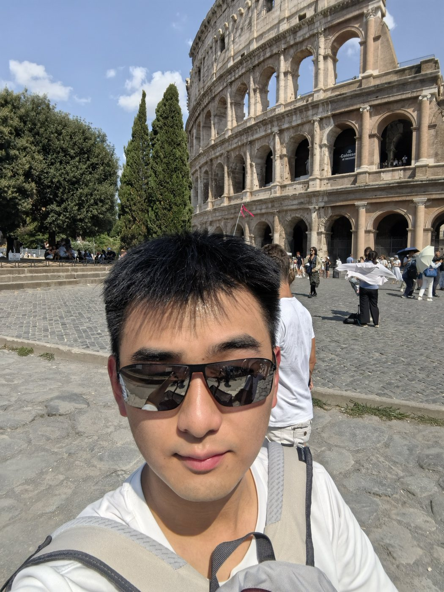</td>
  </tr>
  <tr>
    <td width="50%">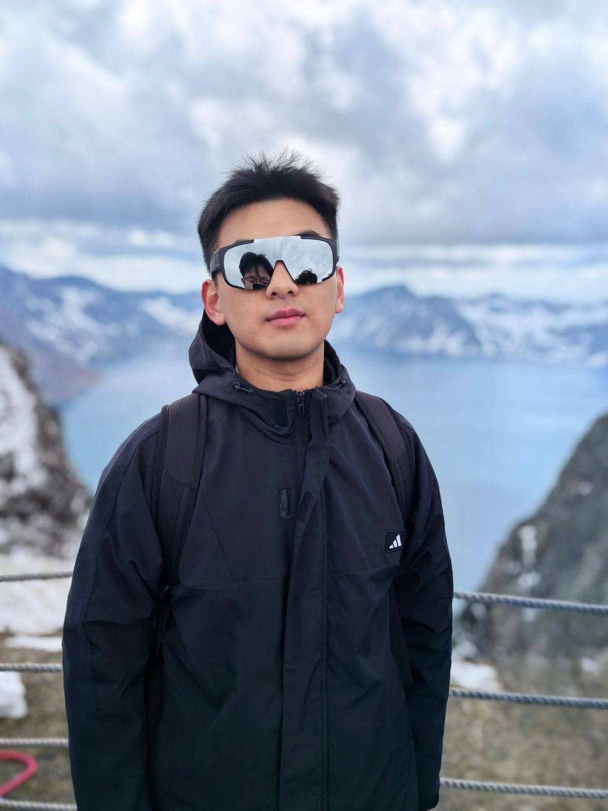</td>
    <td width="50%">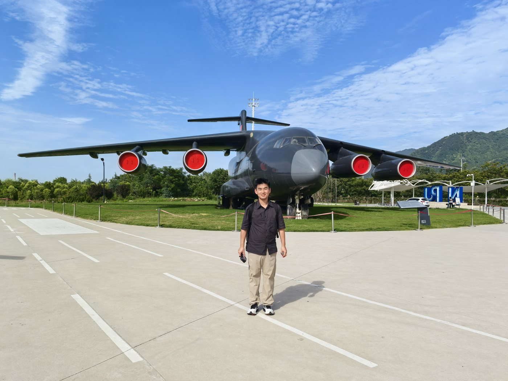</td>
  </tr>
</table>

<h2>Skills &amp; Tools</h2>

    
    
    
    
    

<h2>Contact</h2>

  
  

© 2026 Gofish · Made with ✳ · Claude palette

<b>🇨🇳 中文</b>

 

<h2>关于我</h2>

<table>
  <tr>
    <td align="center" width="200"></td>
    <td>你好，我是 Gofish。目前在南方科技大学攻读数学硕士，本科就读于大连理工大学数理基础科学专业。数学是我理解问题的起点，而人工智能让我不断遇见新的问题。  我尤其感兴趣的是：智能体如何从经验中改进自己，以及智能如何通过感知与行动，真正走进物理世界。希望在扎实的数学思考和具体的实验之间，找到自己的研究方向。  屏幕之外，我喜欢旅行、打羽毛球、炒菜做饭和看电影。对我来说，认真研究一个问题，和认真做好一顿饭，都值得投入。</td>
  </tr>
</table>

- 🧑 **22 岁 · 男生 · 2026 年记**
- 🎓 **大连理工大学** · 数理基础科学 · 本科（2022 — 2026）
- 🎓 **南方科技大学** · 数学 · 硕士（2026 — 2029）
- 🧭 **Agent RSI · Physical AI**

<h2>求学之路</h2>

<table>
  <tr>
    <td width="40">🎓</td>
    <td><b>南方科技大学</b> Southern University of Science and Technology</td>
    <td>数学 · 硕士</td>
    <td align="right">2026 — 2029</td>
  </tr>
  <tr>
    <td width="40">🎓</td>
    <td><b>大连理工大学</b> Dalian University of Technology</td>
    <td>数理基础科学 · 本科</td>
    <td align="right">2022 — 2026</td>
  </tr>
</table>

<h2>我正在好奇的事</h2>

从抽象的推理出发，走向能够学习、行动与持续改进的智能。

<h3>01 · Agent RSI — 智能体 · 递归自我改进</h3>

我关注智能体如何在行动、反馈与反思中积累经验，逐步改进自己的策略与能力。也希望理解：我们该如何可靠地衡量这种改进？

自主学习 · 反馈与反思 · 能力评估

<b>行动 → 反馈 → 反思 → 改进</b>

<h3>02 · Physical AI — 感知 · 行动 · 真实世界</h3>

我对连接数字智能与物理世界的问题充满好奇：如何理解环境、建立世界模型，并把推理转化为可靠的行动？

具身智能 · 世界模型 · 感知与决策

<b>感知 → 理解 → 决策 → 行动</b>

<h2>也在认真生活</h2>

生活不只有一个坐标系。去山野里走走，在球场上流汗，也在厨房和电影里寻找小小的惊喜。

<table>
  <tr>
    <td width="40" align="center">↗</td>
    <td><b>羽毛球</b></td>
    <td>挥拍、跑动、流汗，给思绪换口气。</td>
  </tr>
  <tr>
    <td width="40" align="center">⌁</td>
    <td><b>旅行与漫游</b></td>
    <td>离开熟悉的路线，收藏不同的风景。</td>
  </tr>
  <tr>
    <td width="40" align="center">◡</td>
    <td><b>炒菜与做饭</b></td>
    <td>在烟火气里，认真对待一日三餐。</td>
  </tr>
  <tr>
    <td width="40" align="center">▷</td>
    <td><b>电影与故事</b></td>
    <td>借一块银幕，体验另一种人生。</td>
  </tr>
</table>

<h2>生活瞬间</h2>

<table>
  <tr>
    <td width="50%"></td>
    <td width="50%"></td>
  </tr>
  <tr>
    <td width="50%"></td>
    <td width="50%"></td>
  </tr>
  <tr>
    <td width="50%"></td>
    <td width="50%"></td>
  </tr>
  <tr>
    <td width="50%"></td>
    <td width="50%"></td>
  </tr>
  <tr>
    <td width="50%"></td>
    <td width="50%"></td>
  </tr>
</table>

<h2>技能与工具</h2>

    
    
    
    
    

<h2>联系我</h2>

  
  

© 2026 Gofish · 用 ✳ 打造 · Claude 配色

